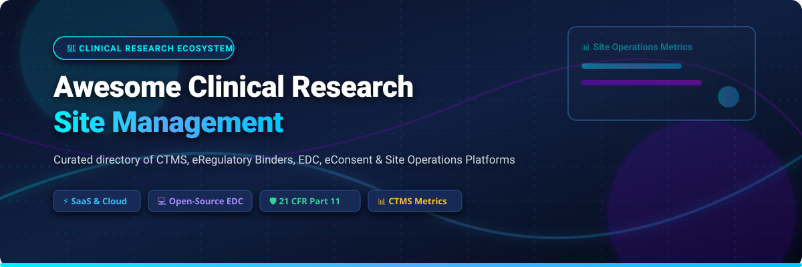

# 🏥 Awesome Clinical Research Site Management

  
  
  
  
  
  

---

## 📌 Executive Summary & Introduction

Welcome to the **Awesome Clinical Research Site Management** repository! This curated directory provides an exhaustive overview of top-tier **SaaS platforms** and **open-source software** powering modern clinical trials, site management operations (CTMS), electronic regulatory binders (eISF/eBinders), Electronic Data Capture (EDC), and patient recruitment workflows.

Whether you represent an Academic Medical Center (AMC), a Site Management Organization (SMO), an independent clinical trial site, or a Contract Research Organization (CRO), this index highlights tools that streamline 21 CFR Part 11 compliance, visit tracking, subject recruitment, and clinical trial financial management.

---

## 📑 Table of Contents

- [🏥 Executive Summary & Introduction](#-executive-summary--introduction)
- [💼 SaaS & Commercial CTMS Platforms](#-saas--commercial-ctms-platforms)
- [💻 Open-Source GitHub Projects](#-open-source-github-projects)
- [🤝 How to Contribute](#-how-to-contribute)
- [⚠️ Disclaimer](#%EF%B8%8F-disclaimer)
- [📈 Star History](#-star-history)
- [💖 Support & Community](#-support--community)

---

## 💼 SaaS & Commercial CTMS Platforms

**Market Overview & Sector Dynamics:** The global Clinical Trial Management System (CTMS) and site management software market is estimated at **$1.8 Billion – $2.4 Billion** (projected to reach **$4.5+ Billion** by 2030 at ~12% CAGR). The market is **moderately fragmented**, with enterprise giant Veeva Systems holding a dominant position among sponsors and large health networks, while specialized vendors (Advarra, Florence, RealTime, CRIO, Castor) actively compete for independent research sites, SMOs, and academic medical centers.

| 🏢 SaaS Platform | 📊 Company Size / Scale | 💵 Starting Pricing | 🆓 Free Tier / Free Trial Limits | 🎯 Core Capabilities & Focus |
| :--- | :--- | :--- | :--- | :--- |
| **[Veeva SiteVault](https://www.veeva.com/)** | **$45.5B Market Cap** / $3.5B Rev (7,000+ FTE) | **~$200 / user / month** (Enterprise tier) | **Free forever for up to 20 active studies** (includes eISF, eConsent & site CTMS) | Regulatory eISF, eConsent, site CTMS, sponsor-site document exchange & 21 CFR Part 11. |
| **[Advarra OnCore](https://www.advarra.com/)** | **~$3.0B Valuation** / $300M Rev (2,500+ FTE) | **~$25,000 / year** (Base enterprise tier) | **14-day interactive demo environment** upon request | Premier enterprise CTMS for Academic Medical Centers & NCI Cancer Centers with EMR integration. |
| **[Clinical Conductor](https://www.advarra.com/)** | **~$3.0B Valuation** / $300M Rev (2,500+ FTE) | **~$500 / month** ($6,000/yr site tier) | **14-day guided trial / demo account** | Site-focused CTMS for research sites and SMOs, covering recruitment, scheduling & budget management. |
| **[Florence Healthcare](https://florencehc.com/)** | **~$500M Valuation** / $35M Rev (300+ FTE) | **~$350 / month** (Base site tier) | **14-day trial / sandbox environment** upon request | Industry-standard eBinders, eISF, eConsent, and sponsor site-enablement workflows. |
| **[Castor EDC](https://www.castoredc.com/)** | **~$200M Valuation** / $20M Rev (150+ FTE) | **$250 / month** (Commercial base plan) | **Free forever for non-commercial academic trials (<5 studies)**; 30-day trial for commercial | Cloud-native EDC, eConsent, eCOA/ePRO, and decentralized clinical trial (DCT) features. |
| **[RealTime CTMS](https://realtime-eclinical.com/)** | **~$100M Valuation** / $20M Rev (120+ FTE) | **~$250 / month** (Site starter pack) | **14-day full access demo sandbox** | Comprehensive site CTMS, patient recruitment engine, eSource, and site financial tracking. |
| **[Clinical Research IO (CRIO)](https://clinicalresearch.io/)** | **~$80M Valuation** / $15M Rev (100+ FTE) | **~$400 / month** (Site starter package) | **14-day request demo environment** | Paperless eSource, eConsent, and CTMS designed specifically for clinical research sites. |
| **[Complion](https://complion.com/)** | **~$500M Parent** ($15M subsidiary rev, 70+ FTE) | **~$300 / month** (Site regulatory tier) | **14-day request demo environment** | Site-focused eRegulatory documentation, electronic signature workflows, and compliance tracking. |
| **[TrialKit](https://crucialdatasolutions.com/)** | **~$30M Valuation** / $10M Rev (50+ FTE) | **$199 / month** (Per study base) | **30-day full feature free trial** | Mobile-first EDC, eCOA/ePRO, and CTMS for clinical trial management. |
| **[SimpleTrials](https://www.simpletrials.com/)** | **~$15M Valuation** / $5M Rev (30+ FTE) | **$99 / month** (Standard plan) | **14-day full-access free trial** | Subscription cloud CTMS & eTMF for small-to-midsize research sites and CROs. |

---

## 💻 Open-Source GitHub Projects

The open-source clinical research software ecosystem is heavily **EDC/CDM & Data Analytics-centric**, providing foundational tools for trial design, data collection, statistical graphics, and AI outcome prediction.

| 📦 Open-Source Project | ⭐ Stars_Count & Stargazers Link | 🛠️ Tech Stack & License | 📝 Overview & Focus |
| :--- | :--- | :--- | :--- |
| **[OpenClinica](https://github.com/OpenClinica/OpenClinica)** |  | Java / LGPL | The pioneer open-source Electronic Data Capture (EDC) and Clinical Data Management System (CDMS). |
| **[Clinical-Trial-Parser](https://github.com/facebookresearch/Clinical-Trial-Parser)** |  | Python / MIT | Meta AI library for parsing and converting unstructured trial eligibility criteria into machine-readable format. |
| **[Clinical-Trial-Outcome-Prediction](https://github.com/futianfan/clinical-trial-outcome-prediction)** |  | Python / PyTorch | Deep learning framework (HINT) for predicting clinical trial phase approval probabilities. |
| **[Healthcare-MCP-Public](https://github.com/Cicatriiz/healthcare-mcp-public)** |  | TypeScript / MIT | Model Context Protocol (MCP) server providing AI agents access to ClinicalTrials.gov, PubMed, and FDA data. |
| **[SAS-Clinical-Trials-Toolkit](https://github.com/wyp1125/SAS-Clinical-Trials-Toolkit)** |  | SAS / MIT | Comprehensive SAS scripts for building CDISC SDTM domains, ADaM datasets, and Define.xml files. |
| **[tern](https://github.com/pharmaverse/tern)** |  | R / Apache-2.0 | Pharmaverse R library for creating clinical trial Tables, Listings, and Graphs (TLGs). |
| **[safetyGraphics](https://github.com/SafetyGraphics/safetyGraphics)** |  | R (Shiny) / MIT | Interactive Shiny app for evaluating clinical trial safety data and adverse event graphics. |
| **[DeepIPW](https://github.com/ruoqi-liu/DeepIPW)** |  | Python / MIT | Deep learning framework for drug repurposing by emulating clinical trials on real-world patient data. |
| **[ClinicalTrialsGov-MCP-Server](https://github.com/cyanheads/clinicaltrialsgov-mcp-server)** |  | TypeScript / MIT | Search ClinicalTrials.gov trials, retrieve study details, and match patients to trials via MCP. |
| **[CogStack-SemEHR](https://github.com/CogStack/CogStack-SemEHR)** |  | Java & Python / Apache-2.0 | Surfacing semantic data from EHR clinical notes for patient trial recruitment and research. |
| **[LibreClinica](https://github.com/reliatec-gmbh/LibreClinica)** |  | Java / LGPL-2.1 | Community-driven open-source successor to OpenClinica for EDC and Clinical Data Management. |
| **[clinicedc/edc](https://github.com/clinicedc/edc)** |  | Python (Django) / GPL-3.0 | Django framework powering 100+ module repos for multisite longitudinal trial data collection. |
| **[arcwell](https://github.com/arcweb/arcwell)** |  | TypeScript (Next.js) / Apache-2.0 | Clinical research platform developed at UPenn supporting eCOA/ePRO and custom clinical rule engines. |
| **[opencdms](https://github.com/opencdms/opencdms)** |  | Python & R / GPL-3.0 | Open Clinical Data Management System suite for public health and academic clinical research. |

---

## 🤝 How to Contribute

Contributions are welcome! Please follow these guidelines:

1. **Submit a PR**: Add new SaaS platforms or open-source repositories to their respective table in alphabetical or sorted order.
2. **Factual Descriptions**: Keep product descriptions objective and highlight specific features (e.g., eISF, eConsent, CTMS).
3. **Verify Links**: Ensure website URLs and GitHub repository links are valid and active.
4. **Reference List**: Check our meta list at [Awesome-Awesome-Awesome](https://github.com/ishandutta2007/Awesome-Awesome-Awesome) for formatting inspiration.

---

## ⚠️ Disclaimer

This repository is maintained for informational purposes only. Product names, logos, brands, and trademarks belong to their respective owners. Listing in this repository does not imply endorsement.

---

## 📈 Star History

---

## 💖 Support & Community

Thank you for visiting and using this repository! If you find this guide helpful for your clinical research operations, please consider supporting the project:

- ⭐ **Star this repository** to help other researchers and clinical coordinators discover these resources.
- 🔀 **Fork & Share** with your team, CRO partners, or academic institution.
- 💬 **Join our Discord**: Connect with the community on [Discord](https://discord.gg/jc4xtF58Ve).
- ☕ **Sponsor / Buy me a coffee**: Support maintenance via the [GitHub Sponsor Dashboard](https://github.com/sponsors/ishandutta2007).
